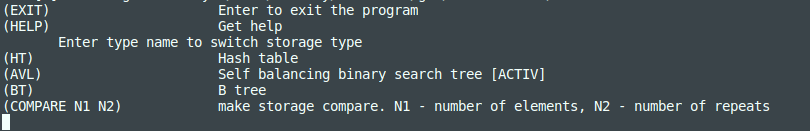

# Transactions
Implementation of in-memory key-value store for storing various financial transaction data.

The project was completed by: Balakina Ekaterina (cshara) - hash table, B+ tree; Borisov Dmitry (bromanyt) - AVL tree.

## Content

Implemented key-value storage was implemented by using three cases:
1. Hash table;
2. AVL tree;
3. B+ tree.

Supported operations: SET, GET, EXISTS, DEL, UPDATE, KEYS, RENAME, TTL, FIND, SHOWALL, UPLOAD, EXPORT.

Multi-threading is used to correctly remove expired items.

Data is entered through the console

## Implementation details

The solution is designed as a static library containing the virtual base class Storage and its corresponding descendants HashTable, SelfBalancingBinarySearchTree, BPlusTree.

To build the library and tests, there is a Makefile (with the goals all, clean, tests), complete coverage of all class methods with unit tests is provided.

