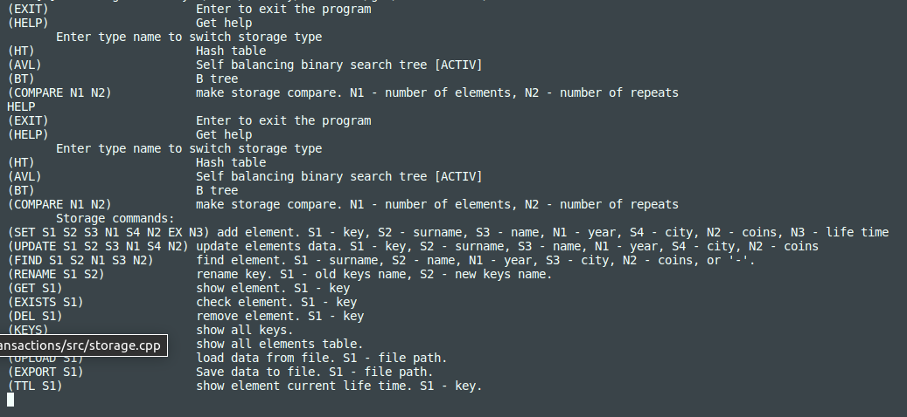
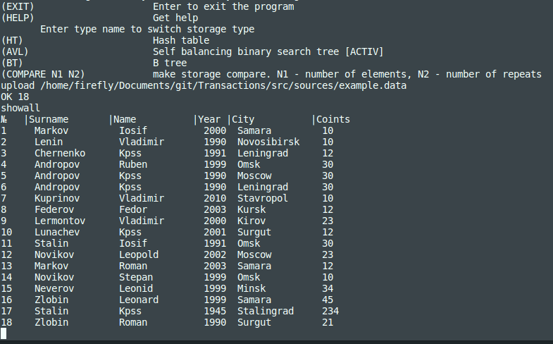

# Transactions

Реализация in-memory key-value хранилища для хранения данных различных финансовых транзакций.

Проект выполнили: Балакина Екатерина (cshara) - хэш-таблица, В+ дерево; Борисов Дмитрий (bromanyt) - АВЛ-дерево.

## Содержание

Реализовано хранилище key-value с использованием трёх вариантов:
1. Хэш-таблица;
2. АВЛ-дерево;
3. В+ дерево.

Поддерживаемые операции: SET, GET, EXISTS, DEL, UPDATE, KEYS, RENAME, TTL, FIND, SHOWALL, UPLOAD, EXPORT.

Для корректного удаления элементов с истёкшим сроком жизни используется многопоточность.

Интерфейс - консольный.

## Подробности реализации

Решение оформлено в виде статической библиотеки, содержащей виртуальный базовый класс Storage  и соответствующих его наследников HashTable, SelfBalancingBinarySearchTree, BPlusTree.

Для сборки библиотеки и тестов имеется Makefile (с целями all, clean, tests), обеспечено полное покрытие unit-тестами всех методов классов.

